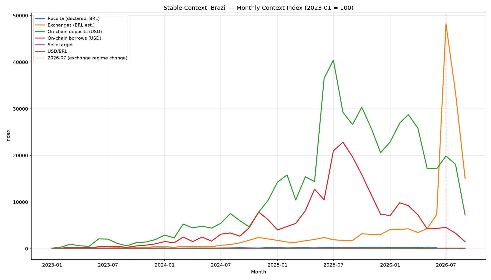
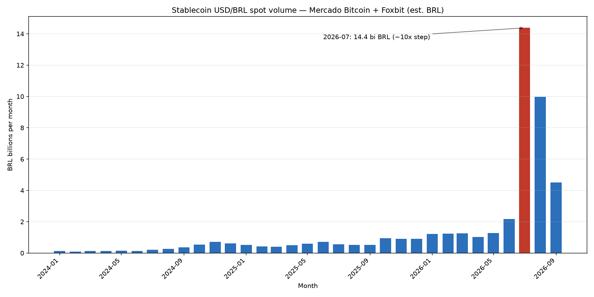
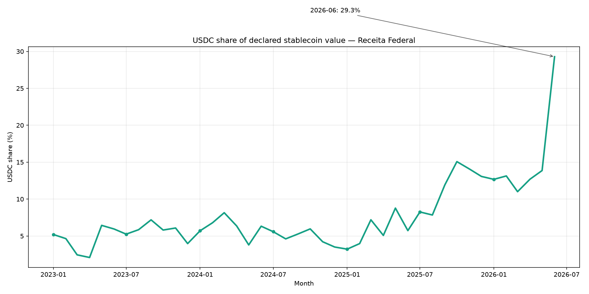

# MVP — Proof of the Central Question

> **Central question:** How can observable stablecoin activity on Ethereum
> help us understand the evolving relationship between Brazil and
> decentralized finance?

## Answer (30 seconds)

**Yes — and it proves the premise of the project.** Observable stablecoin
activity produces measurable, cross-validated signals about Brazil's
relationship with DeFi:

1. **Brazilian-facing stablecoin activity grew steadily and broke out in
   2026-07** — declared value tripled (15 → 48 bi BRL/month) and exchange
   spot notional jumped ~10× in a single month (14.4 bi BRL, 93% on
   Foxbit).
2. **Global on-chain lending tells a different story** — deposits peaked
   Jul-2025 (23.3 bi USD) and declined ~57%, even as Brazilian measures
   kept rising. Brazil cannot be read through global aggregates alone.
3. **Three independent sources converge on a USDC shift in 2026** —
   Receita (5% → 29.3% by 2026-06), exchanges (49.7% of 2026 YTD) and
   on-chain deposits all moved USDT→USDC in the same window.

These are **signals for investigation**, evidenced below — not causal
claims.

## Evidence trail

| # | Observed signal | Numbers | Source dataset | Finding |
|---|---|---|---|---|
| 1 | Declared stablecoin value growth | 15.3 bi BRL (2023-01) → 52.2 bi (2026-05) | `receita_stablecoin_activity.csv` | 02 |
| 2 | Exchange regime change (2026-07) | 2.2 → 14.4 bi BRL/month; sustained across days; 93% Foxbit | `exchange_stablecoin_activity.csv` | 03 |
| 3 | On-chain peak + divergence | deposits 23.3 bi USD (2025-07) → 9.9 bi (2026-06) | `ethereum_lending_activity.csv` | 04 |
| 4 | USDC share convergence | 5% → 29.3% (Receita); 49.7% YTD (exchanges); mix flip (on-chain) | monthly context | 01, 02, 03, 04 |
| 5 | Macro context windows | Selic 10.5% ↔ 15.0%; USD/BRL 4.80 ↔ 6.10 | `bcb_monthly.csv` | 05 |

## Figures

### 1. Cross-source evolution (divergence + growth)



Normalized index (2023-01 = 100). On-chain (deposits/borrows) peaks in
mid-2025; Receita and exchanges keep rising; the 2026-07 exchange break
stands out; Selic/USD-BRL supply the context lines.

### 2. The 2026-07 exchange breakout



Monthly USDT/USDC-BRL spot notional (Mercado Bitcoin + Foxbit). A single
bar — July 2026 — carries ~6.6× the previous month.

### 3. The USDC shift in declared activity



USDC share of declared stablecoin value jumped from ~5% (2023–2025) to
29.3% in June 2026 — the compositional signal replicated by the other two
sources.

## Why this answers the question

The question is *how* stablecoin activity helps understand Brazil's
relationship with DeFi. The project shows a **working method**, not just
a number:

```
Observable stablecoin activity (4 sources, 3 layers)
  → standardized monthly frame (Bronze→Silver→Gold)
  → observed signals (growth, divergence, composition, context)
  → hypotheses to investigate (docs/analysis-findings/06)
  → external context to test them (docs/context/)
```

Each step is reproducible (`docs/refresh.md`, `tests/`) and every finding
distinguishes observed data, derived metrics, signals and interpretation.

## What it does NOT prove (scope)

- It does not identify Brazilian wallets or individuals.
- It does not establish causality between macro events and on-chain
  activity — only temporal overlap (see finding 05).
- The exchange breakout is concentrated on one venue (Foxbit); venue-level
  causes are unresolved (checklist, window B).
- The 2026 USDC shift has no confirmed external cause yet (checklist,
  window A).

## Reproduce in 3 commands

```bash
pip install -r requirements.txt
python3 -m unittest discover -s tests -v        # 16 data-integrity tests
jupyter notebook notebooks/01-exploratory-analysis.ipynb   # findings, reproducible
```

Full pipeline: `docs/refresh.md`.

## Submission checklist

- [x] Central question stated and answered (`README.md`, this document)
- [x] Evidence trail with real datasets (findings 01–06)
- [x] Three evidence figures (`docs/figures/`)
- [x] Reproducible pipeline + tests + refresh runbook
- [x] External-context registry + verification checklist
- [ ] (Optional) Walkthrough video using `notebooks/01-exploratory-analysis.ipynb`

---

Generated for the MVP submission. Full documents: `docs/analysis-findings/`,
`docs/methodology.md`, `docs/data-sources.md`.